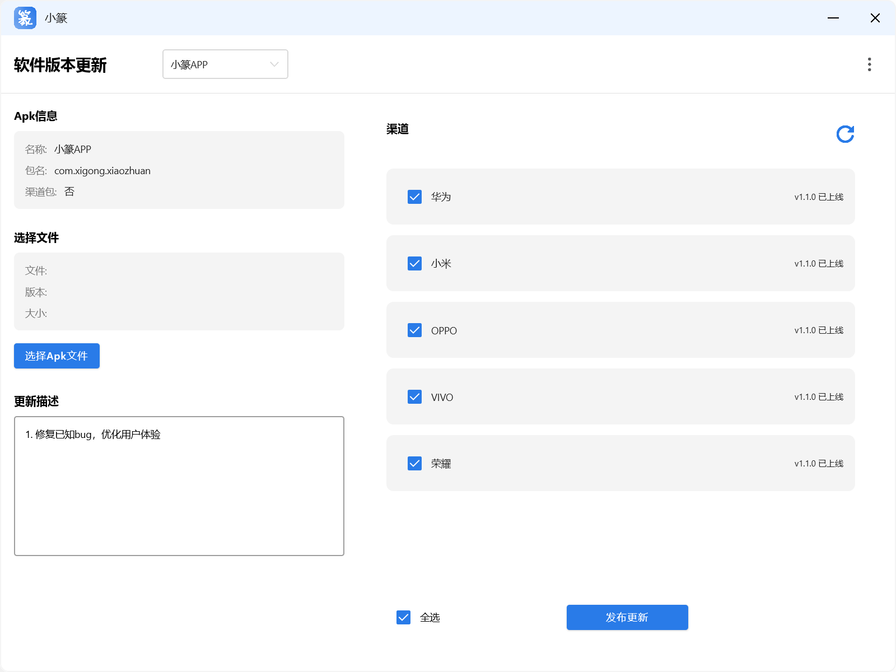
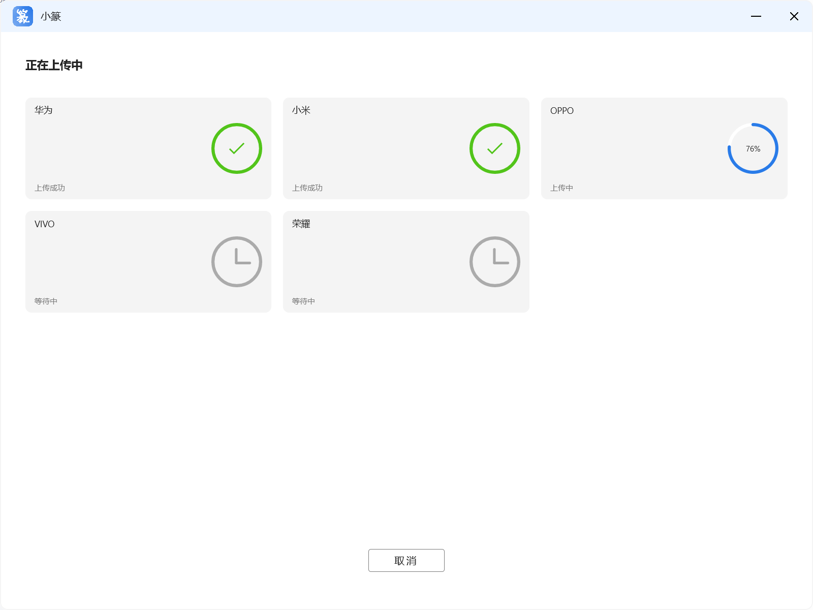
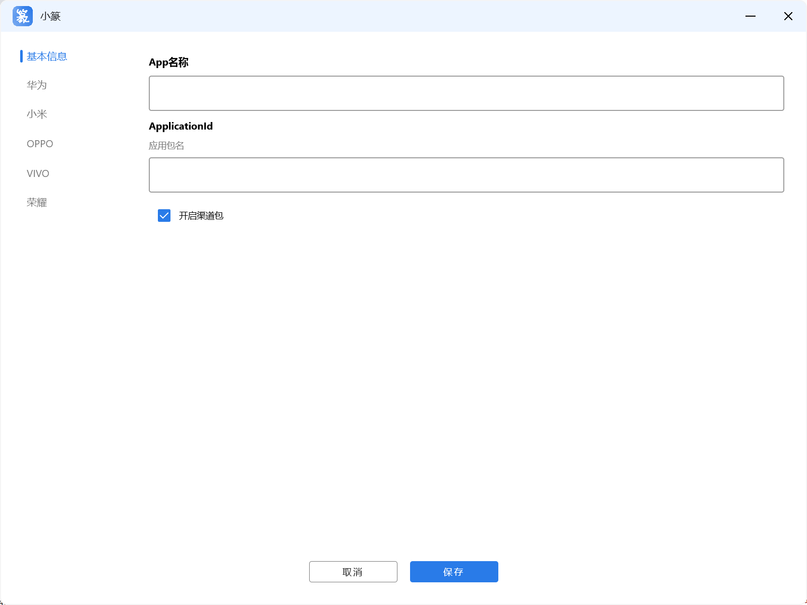
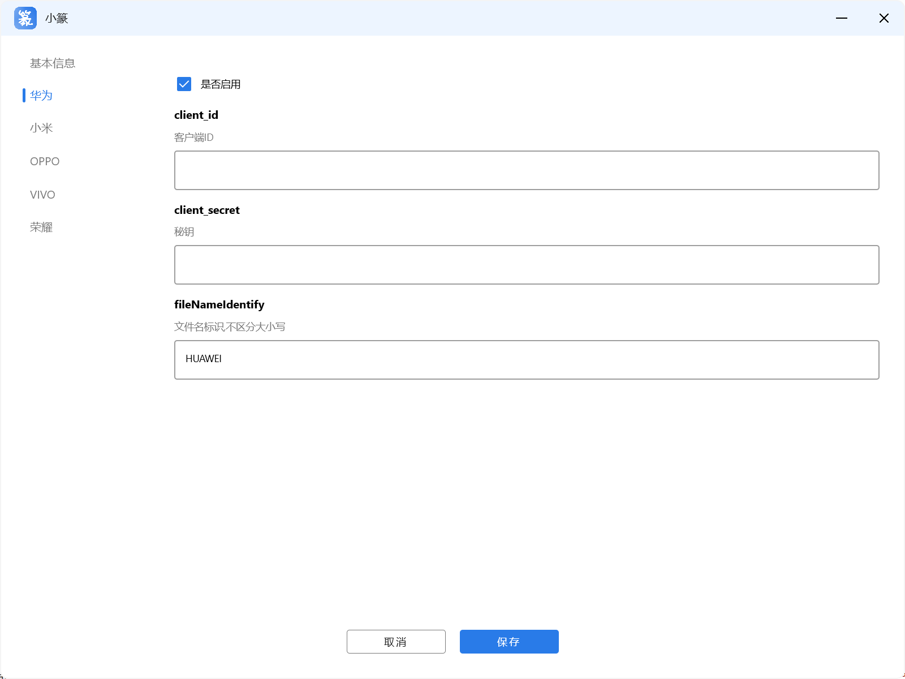

# 小篆 
<a href="./doc/ENGLISH.md">English README</a>

一键上传Apk到多个应用市场，开源，免费

## 应用界面截图

### 1. 首页

### 2. 提交新版本页面

### 3. 新增APP页面

## 特点：

1. 使用应用市场提供的Api传包功能，安全，稳定，快捷
2. 代码开源，完全免费，不会向第三方上传任何相关账号信息
3. 基于Compose Desktop 开发，支持Windows 和Mac OS

## 如何使用
1. 新增APP

2. 渠道包功能
3. 版本更新功能

## 功能限制

1. 仅支持华为、小米、OPPO、VIVO、荣耀 5个应用市场
2. 仅支持32位和64位合并版包，暂不支持分包上传

## 自己编译
<a href="./doc/Develop.md">请点击这里查看开发文档</a>

## 常见问题的解决

<a href="./doc/TroubleShotting.md">点击这里查看常见问题</a>