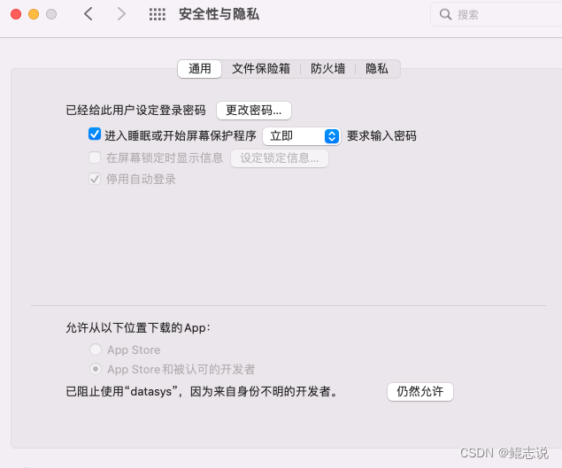

# 小篆传包  

一键上传Apk到多个应用市场，开源，免费，助力App发版。

<a href="./doc/ENGLISH.md">English README</a>

## 软件的适合人群
- 安卓开发工程师
- App 运营
- App 产品经理

## 应用界面截图

### 1. 首页

### 2. 提交新版本页面

### 3. 新增APP页面

## 特点：

1. 使用应用市场提供的Api传包功能，安全，稳定，快捷
2. 代码开源，完全免费，不会向第三方上传任何相关账号信息
3. 基于Compose Desktop 开发，支持Windows 和Mac OS

## 如何使用
<a href="./doc/Instructions.md">点击这里查看功能文档</a>

## 安装包下载
Windows 是绿色版，下载解压后，直接启动

Mac 版本未签名，需要配置以后才可以打开

1. 点击屏幕左上角的苹果图标，选择菜单：找到系统偏好设置
2. 打开系统偏好设置界面，点击"安全性与隐私"-“通用”
3. 窗口底部允许从以下位置下载的App会看到：已阻止使用“XXX”，因为来自身份不明的开发者。点击后面的"仍要打开"按钮
4. 在弹出的确认弹窗中，点击"打开"按钮即可
   

<a href="https://gitee.com/xigong93/XiaoZhuan/releases">从Gitee下载(推荐)</a>

<a href="https://github.com/xigong93/XiaoZhuan/releases">从Github下载</a>

## 功能限制

1. 仅支持华为、小米、OPPO、VIVO、荣耀 5个应用市场
2. 仅支持32位和64位合并版包，暂不支持分包上传
3. 仅支持更新已上架的APP，不支持新增APP

## 自己编译
<a href="./doc/Develop.md">请点击这里查看开发文档</a>

## 常见问题的解决

<a href="./doc/TroubleShotting.md">点击这里查看常见问题</a>

## 已知问题
1. 小米的传包Api不显示当前审核的版本，只返回线上的最新版本

2. OPPO 提交新版本后，有几分钟的延迟，过几分钟后才会显示新版本正在审核中

3. VIVO应用市场获取应用审核状态，有时候会报错，原因是此接口限制请求频率，每分钟不得超过3次

## 问题反馈
<a href="./issues">点击这里反馈问题</a>

## 写在最后
撸码不易，欢迎点赞对我进行鼓励，点赞越多，优化越快